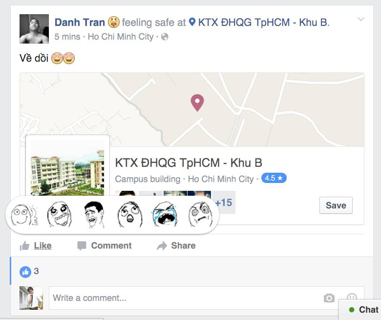

# facebook-theme
A Chrome extension used to custom Facebook UI

How it works:
- It's an Chrome Extension
- Detect whether the page is Facebook
- Change css, pointing resources to my resources.
- So that we have a new Facebook UI :D

Improve idea:
- Remove Facebook Ads by my custom frames etc.

Demo: Replace Facebook reaction icons by my memes

